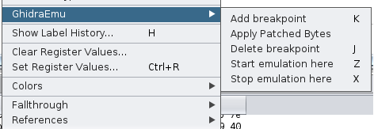

# GhidraEmu

This project was initially started as a part of [Digital Security](https://github.com/DSecurity)'s Research Centre internship "Summer of Hack 2021".

Plugin allows you to easily dealing with native pcode emulator. No scripts anymore, just use it from Ghidra. 

## What can it do
  * Work with all archs that ghidra supports, so you can add exotic processors and emulate them
  * CPU context, stack and heap emualtion
  * Applying patched bytes from Ghidra
  * Breakpoints to control emualtion process
  * Hook some libc functions (but it is still poor)

 ## What it can't
  * Step in external library functions (emuHelper restrictions, can't get access to one program space from another)
  * Syscall emulation
  
# Features
  
  Menu window
  
  
  
  Popup window
  
  
  
  
# Installation
  
- Download Release version of extension and install it in Ghidra `File → Install Extensions...` 
- Use gradle to build extension: `GHIDRA_INSTALL_DIR=${GHIDRA_HOME} gradle` and use Ghidra to install it: `File → Install Extensions...` 

