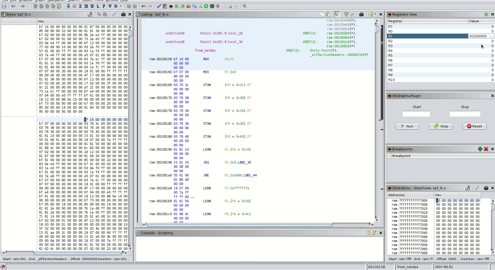
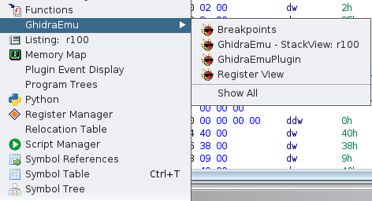
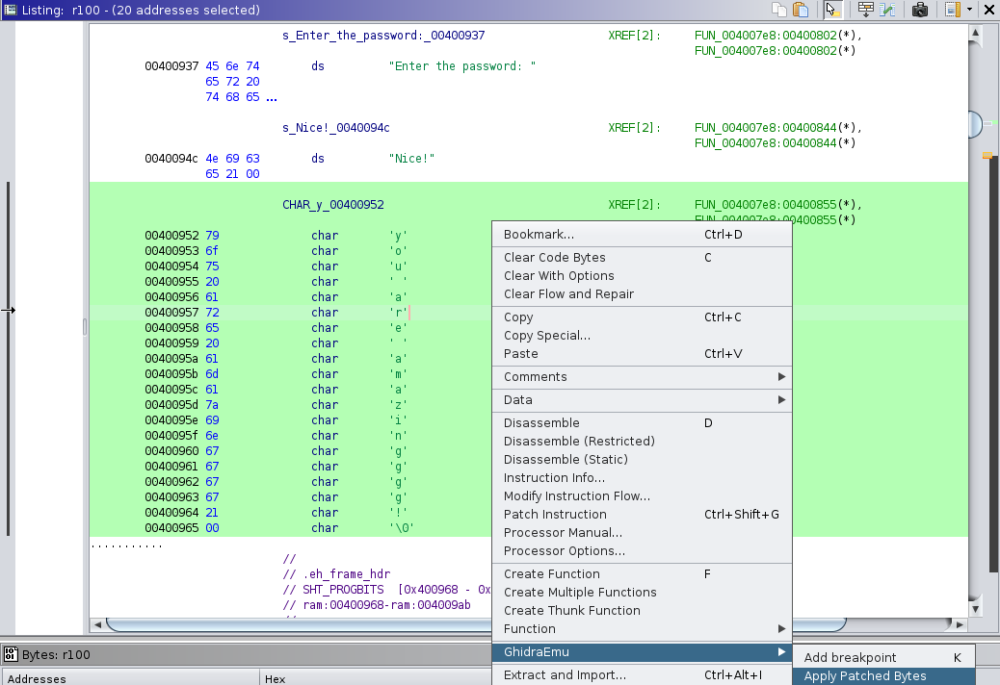
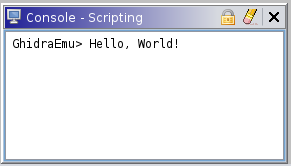

# GhidraEmu

  
This Ghidra plugin allows you to easily deal with native pcode emulation. No scripts anymore, just use it from Ghidra. It can be useful for working with a variety of exotic processors, support for which is not implemented in common emulators.

If the processor/vm supported by Ghidra for reverse engineering — it can be emulated! Example, eBPF instructions emulation below:

 

 
## What can it do

 In fact, the plugin is an extended wrapper around the classes inside the package `ghidra.app.emulator`. Here is what has been implemented:

  * Works with all architectures that Ghidra supports, so you can add exotic processors and emulate the such programs
  * CPU context, stack, and heap emulation
  * Applying patched bytes through Ghidra GUI to influence the course of emulation
  * Breakpoints to control emulation process
  * Displaying of changed bytes during emulation in Ghidra's ByteViewer
  * Hook some libc functions (but it is still poor)

 ## What it can't
  * Step inside external library functions (emuHelper restrictions)
  * Syscall emulation
  
 ## All plugin windows in one set
  

# Features
  
### Menu window
Contains all plugin's windows - Stack view, Registers, Breakpoints view, and Main window.
 
  
  
### Popup window
Contains hotkeys for setting start and end addresses of emulation, breakpoints and applying changed bytes to emulator.

 
 
 #### Register view
Change registers as you want. Setting as link register (green arrow) will help emulator let it know which register contains return address. Plugin knows how it goes via stack, lr register, AARCH64 and mips registers. If you have an exotic one, select link register and press the button.
 
 
 
#### Stack view
When you open your program in Сode browser GhidraEmu will map stack space automatically. Stack pointer will be set at the middle of stack range. It was done to allow you to set values at top or bottom stack frames. Set your values as you want. Scroll it if you get some freezes on updating or resetting. During the emulation process, if the program needs more space for the stack, the plugin will allocate it automatically.
 
 
 
#### Breakpoints view
 
 
 
#### RAM view

If any bytes change during the emulation, you will see them in the classic ByteViewer. Do not worry, they will be reset to their original values after pressing **"Reset"** button.

 

#### Apply patched bytes
If you changed something, let emulator know about changed bytes (stack updates automatically, no need for it). After changing, select them (will be green), and press this option (or hotkey "M"). 
 
  
 
#### Console
Here plugin prints output information.
 
  

 
# Before you start
**A few important points to consider**:
* Don't forget to analyze your program in Ghidra, emulator depends on it.
* If you have changed any bytes through the ByteViewer, the plugin won't restore them to their original values during resetting emulation state.
* Before closing the project in Ghidra, you should press the "Reset" button and reset the state of the last emulation, if such an action was not performed. This is important, because at the moment of closing, transactions for repainting traced instructions in the listing will not be executed, as well as transactions for restoring program bytes after emulation. This can lead in the future not only to the contemplation of the "old yellow parrot", which is the least problem, but the bytes modified as a result of emulation will remain as such and will not return to their original values (unless the project is rolled back in Ghidra, of course).

# Installation
  
- Download Release version of extension and install it in Ghidra `File → Install Extensions...` 
- Use gradle to build extension: `GHIDRA_INSTALL_DIR=${GHIDRA_HOME} gradle` and use Ghidra to install it: `File → Install Extensions...` 
- In CodeBrowser go to `File → Configure → Experimental` and select checkbox.

## Feedback
Got some bugs while using the plugin or have ideas for improvements? Don't be shy to open new Issue and I'll figure it out.
 
## Future work  
 
EmuHelper restrictions don't allow using program space in another. So your external shared library, for example, will never know about program memory space and vice versa. So you can't emulate it as one process with one memory space. Let me know if I'm missing something here. 
  

 

