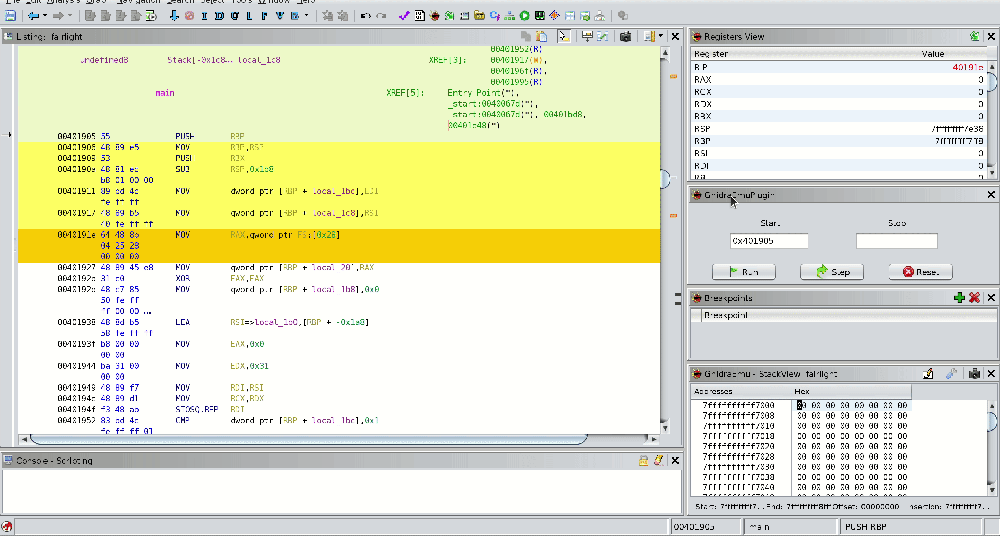

# GhidraEmu

  
This experimental Ghidra plugin allows you to easily deal with native pcode emulation. No scripts are needed anymore, just use it directly from Ghidra. It can be particularly useful for working with a variety of exotic processors that are not supported by common emulators.

If the processor/vm is supported by Ghidra for reverse engineering, it can be emulated! For example, eBPF instructions emulation is demonstrated below:

 

 
## What can it do

 In essence, the plugin is an extended wrapper around the classes inside the `ghidra.app.emulator` package. Here is what has been implemented:

  * Works with all architectures that Ghidra supports, so you can add exotic processors and emulate them
  * CPU context, stack, and heap emulation
  * Applying patched bytes through Ghidra GUI to change the course of emulation
  * Breakpoints to control the emulation process
  * Displaying changed bytes during emulation in the ByteViewer
  * Hooking some libc functions (although this is still poor)

Although PCode emulation ideally implies unification, most processors need their own approach. Feel free to report any issues you encounter. I would really like to test all of processors, but it's hardly possible.

## What it can't

* Step inside external library functions (EmulatorHelper restrictions)
* Syscall emulation

## All plugin windows in one set
  

# Features
  
### Menu window

Contains all plugin windows: Stack view, Registers, Breakpoints view, and Main Window.
 
  
  
### Popup window

Contains hotkeys for setting the start and end of emulation, breakpoints, and applying changed bytes to the emulator state.

 
 
 #### Registers view

Change registers as you want. Setting the link register (green arrow) will help the emulator understand which register contains the return address. The plugin knows how it works via the stack, lr register, AARCH64, and MIPS registers. If you have an exotic one, select the link register and press the button.
 
 
 
#### Stack view

When you open your program in the СodeBrowser GhidraEmu will map the stack space automatically. The stack pointer will be set in the middle of the stack range. This allows you to set values at the top or bottom of stack frames. Scroll it if you experience freezes on updating or resetting. During the emulation process, if the program needs more space for the stack, the plugin will allocate it automatically.
 
 
 
#### Breakpoints view
 
 
 
#### RAM view

If any bytes change during the emulation, you will see them in the classic ByteViewer. Don't worry, they will be reset to their original values after pressing the **"Reset"** button.

 

#### Apply patched bytes

If you made changes, let the emulator know about changed bytes (stack updates automatically -- no need for it). After changing, select them (they will be green), and press this option (or use the hotkey "M"). 
 
  
 
#### Console

Here plugin prints output information. For example, emulation error messages like this:
 
  

### New feature - Jump Over

The "Jump Over" feature allows you to jump ahead one instruction if you don't want to emulate the current one for some reason. Since the emulation process will be aborted if an attempt to read uninitialized memory is detected, this feature allows you to bypass it. Look at an example. Here's one of the first instructions in many x86_64 programs, canary stack saving:

`MOV RAX, qword ptr FS:[0x28]`

We'll just try to cheat a little and jump over it by increasing the PC value. To do this, stop at the instruction you don't want to emulate and press `J` hotkey. Otherwise, stepping further would result in an uninitialized memory read error.

### New feature - Step Over

If you stop at an instruction that leads to a subroutine (internal call) and you want to emulate everything up to the next instruction (classic "step over"), press the `F6` hotkey, and it will certainly happen:

# Before you start
**A few important points to consider**:
* Don't forget to analyze your program in Ghidra, the emulator depends on it.
* As already mentioned, set the link register if you have an exotic processor/vm.
* If the processor of your binary needs certain memory segments according to the specification, don't forget to create them in Ghidra MemoryMap Window and initialize them with zeros. Otherwise, the emulator will complain about unknown memory spaces during read/write operations and will stop the emulation process. If a memory block exists but is not initialized with zeros and is needed by the emulator, the plugin will try to make it initialized so that the emulation continues.
* If you have changed any bytes through the ByteViewer, the plugin won't restore them to their original values during resetting the emulation state.
* Before closing the project in Ghidra, you should press the "Reset" button and reset the state of the last emulation if it hasn't been done yet. This is important because at the moment of closing, transactions of repainting traced instructions in the Listing will not be executed, as well as transactions of restoring program bytes after emulation. This can lead not only to the beholding of the "old yellow parrot", which is the least problem, but also to the modified bytes remaining as such and not returning to their original values (unless the project is rolled back in Ghidra, of course).

# Installation
  
- Download the release version of the extension and install it in Ghidra using `File → Install Extensions...` 

- Use gradle to build the extension: `GHIDRA_INSTALL_DIR=${GHIDRA_HOME} gradle` and use Ghidra to install it: `File → Install Extensions...` 

- In the CodeBrowser, go to `File → Configure → Experimental` and select the checkbox.

## Feedback

Encountered any bugs while using the plugin or have ideas for improvements? Don't be shy to open new issue and I'll figure out.
 
## Future work  
 
EmulatorHelper restrictions don't allow using program space in another. So your external shared library, for example, will never know about program memory space and vice versa. So you can't emulate it as one process with one memory space. Let me know if I'm missing something here.
 
