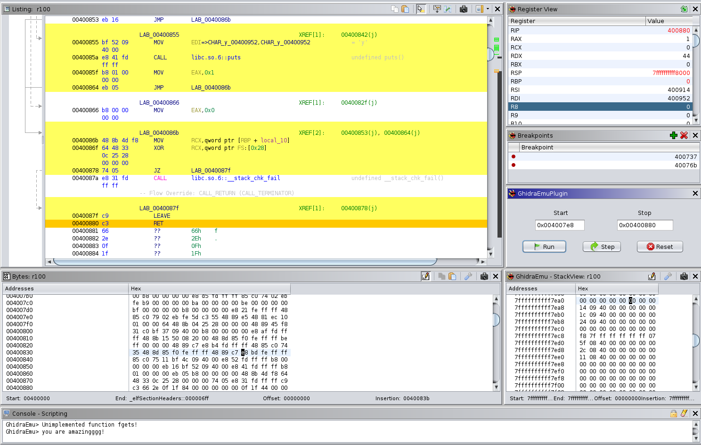
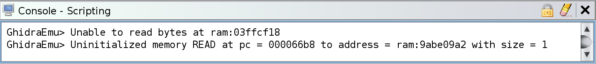

# GhidraEmu

This project was initially started as a part of [Digital Security](https://github.com/DSecurity)'s Research Centre internship "Summer of Hack 2021".

Plugin allows you to easily dealing with native pcode emulator. No scripts anymore, just use it from Ghidra. 
 

 
## What can it do
  * Work with all architectures that ghidra supports, so you can add exotic processors and emulate them
  * CPU context, stack and heap emualtion
  * Applying patched bytes from Ghidra
  * Breakpoints to control emualtion process
  * Hook some libc functions (but it is still poor)

 ## What it can't
  * Step in external library functions (emuHelper restrictions)
  * Syscall emulation
  
 ## All plugin windows in one set
  

 
# Features
  
### Menu window
Contains all plugin's windows - Stack view, Registers, Breakpoints view and main window.
 
  
  
### Popup window
Contains hotkeys for setting start and end addresses of emulation, breakpoints and applying changed bytes to emulator.

  
 
 #### Register view
Change registers as you want. Setting as link register (green arrow) will help emulator let it know which register contatins return address. Plugin knows how it goes via stack, lr register, AARCH64 and mips registers. If you have an exotic one, select link register and press the button.
 
 
 
#### Stack view
When you open your program in Сode browser GhidraEmu will mmap stack space automaticaly. Stack pointer will be set at middle of stack space. It was done to allow you set values at top or bottom stack frames. Set your values as you want. Scroll it if you got some freezes on updating or reseting.
 
 
 
#### Breakpoints view
 
 
 
#### Apply patched bytes
If you changed something, let emulator know about changed bytes.
 
  
 
#### Console
Here plugin prints output information.
 
  
 
## Future work  
 
EmuHelper restrictions doesn't allow to use on program space in another. So your external shared library, for example, will never know about program memory space and vice versa. So you can't amulate it as one process with one memory space. Let me know if I'm missing something here. 
  
# Installation
  
- Download Release version of extension and install it in Ghidra `File → Install Extensions...` 
- Use gradle to build extension: `GHIDRA_INSTALL_DIR=${GHIDRA_HOME} gradle` and use Ghidra to install it: `File → Install Extensions...` 
- In CodeBrowser go to `File → Configure → Experimental` and select checkbox.

 

